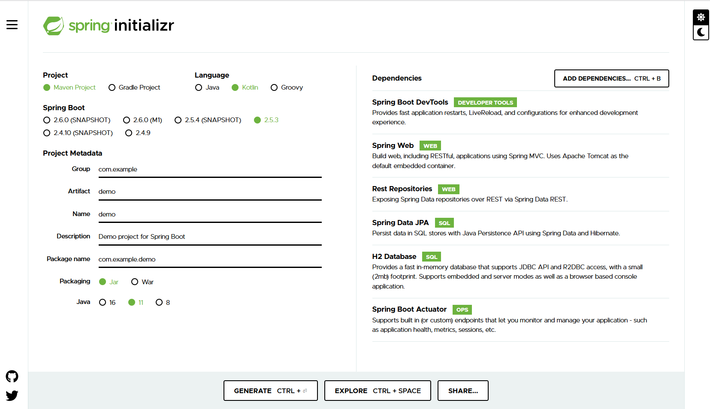

# prime-springboot-kotlin-ms
Prime app supporting services built using kotlin. More details About kotlin can be found at [Kotlin Alpha](https://github.com/Dhruvaraju/kotlin_alpha).
The below-mentioned services are active as of now:

- Customer Registration (/api/v1/register - Post)
- Customer Authentication (/api/v1/authenticate - Post)
- Products (Stocks, Financial Products)
  - Buying Products (/api/v1/product/buy - Post)
  - Selling Products (/api/v1/product/sell - Post)
- IPO
  - Register IPO (/api/v1/ipo/register - Post)
  - Fetch Customer Initiated IPO (/api/v1/ipo/{userName} - Get)
- Mutual Funds
  - Register Mutual Fund (/api/v1/mutual-fund/register - Post)
  - Customer Owned Mutual Funds (/api/v1/mutual-fund/{userName} - Get)
- Messages aka contactus page
  - Add message (/api/v1/messages/register - Post)
  - read all messages (/api/v1/messages - Get)

This is a maven project Entities, Repositories, Enums, services and controller files are present in corresponding folder.

## Initial Project Setup
- Navigate to start.spring.io, provide basic maven coordinates.
- Choose spring web, rest repositories, spring data jpa, H2 dependencies and click generate project.
- Once downloaded, import it as an existing project to Intellij or spring tool suite.
- It can be started to get profile json screen on `http://localhost:8080`

**Screenshot of start.spring.io:**


## Defining Entities
- Schema of tables available in database are called entities.
- In Kotlin is considered as a data class annotated with `@Entity` annotation.
- `@Entity` will allow spring-boot to identify the data class as a table.
- Provide `@Table` annotation to bind a table with data class, Table name is added as an attribute `@Table(name = "Contact_Us")`.
- Primary key is defined with annotation `@Id`.
- Use @Column annotation to bind it with a field in table like `@Column(name = "Id")`.
- ID field can be auto generated which can be achieved using annotation `@GeneratedValue(strategy = GenerationType.IDENTITY)`
- For all the other fields binding with `@Column` is enough.

**Example for entity class:**
```kotlin
@Entity
@Table(name = "Contact_Us")
data class ContactUs(
        @Id
        @Column(name = "Id")
        @GeneratedValue(strategy = GenerationType.IDENTITY)
        private var id: Long?,
        @Column(name = "User_Name")
        val userName: String?,

        @Column(name = "Email")
        val email: String?,

        @Column(name = "Phone_Number")
        val phoneNumber: String?,

        @Column(name = "Message")
        val message: String?,

        @Column(name = "Message_Added_On")
        var messageDate: LocalDate? = null
)
```

## Defining Repository
- After creating a table, we need to extract behaviour using CRUD(Create, Read, Update, Delete) operations.
- We don't have to write lots of code for it, Create an interface extending `CRUDRepository` or `JPARepository`.
- It will provide many default functionality, A simple repository implementations appears as below:
- JPA or CRUD repository will accept two inputs as reference type
  - Entity Class
  - Primary Key type of Entity class
- For Creating entries use `Repository.save(EntityClass)`
- Reading data can be done using 
  - `Repository.findAll()`
  - `Repository.findById(Id)`
- Updating can be done using `Repository.save(EntityClass)`
- Deleting can be done using `Repository.delete(Entity)`


```kotlin
@Repository
interface ContactUsRepository: JpaRepository<ContactUs, Long> {

}
```

Operation | Repository Function | HTTP Method
--- | ---- | ----
Create | `Repository.save(EntityClass)` | POST
Read | `Repository.findAll()` | GET
Update | `Repository.save(EntityClass)` | PUT or PATCH or POST
Delete | `Repository.delete(Entity)` | DELETE

### Find Can be done on multiple fields at a time
> All find operations are http GET calls.

Operation | Description
---- | ----
`Repository.findAll()` | List of all entries in table will be returned
`Repository.findById(Id)` | Gets a resource or row based or Id
`Repository.findContactUsByUserName(userName)` | List of resources with same username will be returned.
`Repository.findContactUsByUsernameAndEmail(userName, Email)` | Fetches the resources with provided username and email
`Repository.findContactUsByUsernameOrEmail(userName, Email)` | Fetches the resources having at-least a provided username or email

> Or & And can be extended for as many fields as you need.

## Creating Service implementation
- To expose this repository operation over network we need to serialize them.
- To do it we can create a service class which will make use of repository functions.
- Use `@Service` annotation to create a service implementation.
- Repository can be passed as constructor parameter to extract its behaviour.
- We can add business functionality in service class.
- Example service implementation is provided below:

```kotlin
@Service
class ContactUsService(val contactUsRepo: ContactUsRepository) {
    fun addUserMessage(userMessageInfo: ContactUs): CommonResponse? {
        userMessageInfo.messageDate = LocalDate.now()
        contactUsRepo.save(userMessageInfo)
        return CommonResponse("ADDED", "Message updated successfully.")
    }

    fun fetchAllMessages(): List<ContactUs?>? {
        return contactUsRepo.findAll()
    }
}
```

## Creating controller Implementation
- Controllers are used to bind a service to URI
- `@RestController` or `@Controller` is used to do this.
- `@RequestMapping` is used to bind a function to URI example: `@RequestMapping(value = ["/api/v1/messages"])`

We might encounter an issue with resource sharing across different origin.
Cross-origin issues occur when we have to serve requests from different servers.
To avoid this we use `@CrossOrigin` annotation. 

**Example Controller Class:**
```kotlin
@RestController
@CrossOrigin
@RequestMapping(value = ["/api/v1/messages"])
class ContactUsController(val contactUsService: ContactUsService) {
    @RequestMapping(value = ["/register"], method = [RequestMethod.POST])
    fun addMessage(@RequestBody userMessage: ContactUs): CommonResponse? {
        return contactUsService.addUserMessage(userMessage)
    }

    @RequestMapping(value = [""], method = [RequestMethod.GET])
    fun fetchAllUserMessages(): List<ContactUs?>? {
        return contactUsService.fetchAllMessages()
    }
}
```

## Postman collection
Start this project locally and import the postman collection present in postman folder of code.
All the URLs can be tested from it.